# Week 2 Homework

For information on week 2 homework see:
[homework.md](https://github.com/DataTalksClub/data-engineering-zoomcamp/blob/main/cohorts/2023/week_2_workflow_orchestration/homework.md)


**Goal of this homework**: familiarise users with workflow orchestration.

## Question 1. Load January 2020 data

Using the `etl_web_to_gcs.py` flow that loads taxi data into GCS as a guide, create a flow that loads the green taxi CSV
dataset for January 2020 into GCS and run it. Look at the logs to find out how many rows the dataset has.

How many rows does that dataset have?

- 447,770
- 766,792
- 299,234
- 822,132

## Solution 1

I slightly modified the **file `etl_web_to_gcs.py:`**

``` python
import os
from pathlib import Path
import pandas as pd
from prefect import flow, task
from prefect_gcp.cloud_storage import GcsBucket


@task(retries=3)
def fetch(dataset_url: str) -> pd.DataFrame:
    """Read taxi data from web into pandas DataFrame"""
    df = pd.read_csv(dataset_url)
    return df


@task(log_prints=True)
def clean(df: pd.DataFrame) -> pd.DataFrame:
    print(df.head(2))
    print(f"columns: {df.dtypes}")
    print(f"rows: {len(df)}")
    return df


@task()
def write_local(df: pd.DataFrame, color: str, dataset_file: str) -> Path:
    """Write DataFrame out locally as parquet file"""
    # Changed this to create the folder if not exists and pass if exists
    try:
        os.makedirs(f"data/{color}/", exist_ok=True)
    except FileExistsError:
        # directory already exists
        pass

    path = Path(f"data/{color}/{dataset_file}.parquet")
    # -----------------------------------------------
    df.to_parquet(path, compression="gzip")
    return path


@task()
def write_gcs(path: Path) -> None:
    """Upload local parquet file to GCS"""
    gcs_block = GcsBucket.load("zoom-gcs")
    gcs_block.upload_from_path(from_path=path, to_path=path)
    return


@flow()
def green_taxi_etl_web_to_gcs() -> None:
    """The main ETL function"""
    # Changed this block to use the data which is to use in homework
    color = "green"
    year = 2020
    month = 1
    # -------------------------------------------------------------
    dataset_file = f"{color}_tripdata_{year}-{month:02}"
    dataset_url = f"https://github.com/DataTalksClub/nyc-tlc-data/releases/download/{color}/{dataset_file}.csv.gz"

    df = fetch(dataset_url)
    df_clean = clean(df)
    path = write_local(df_clean, color, dataset_file)
    write_gcs(path)


if __name__ == "__main__":
    green_taxi_etl_web_to_gcs()
```

Below is the output appearing in Prefect Cloud logs.

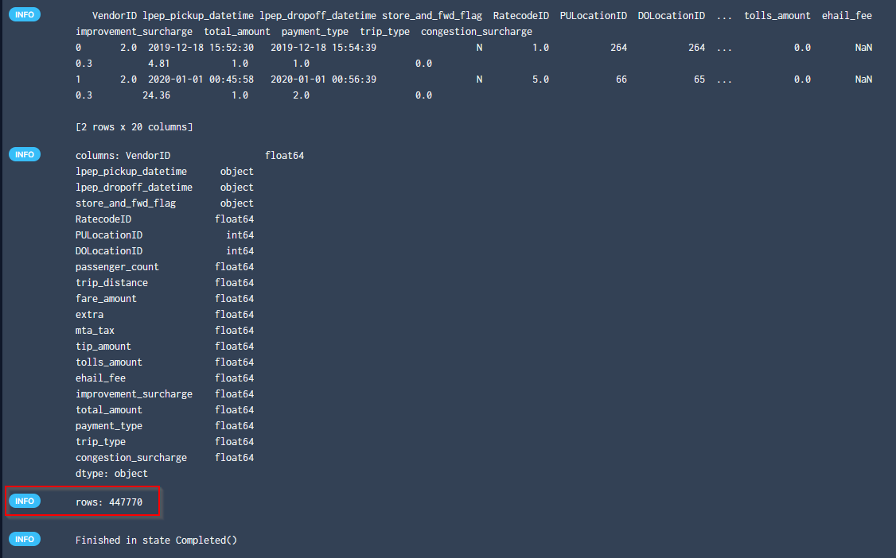

The answer is in the output of the logs.

## Question 2. Scheduling with Cron

Cron is a common scheduling specification for workflows.

Using the flow in `etl_web_to_gcs.py`, create a deployment to run on the first of every month at 5am UTC. What’s the
cron schedule for that?

- `0 5 1 * *` 
- `0 0 5 1 *`
- `5 * 1 0 *`
- `* * 5 1 0`

## Solution 2.


To check if this is the answer, we can run the python script according to the `0 5 1 * *` schedule in Prefect with the
following commands.

``` bash
conda activate zoom
prefect orion start
prefect deployment build week_2_workflow_orchestration/homework/solutions/question_1/q1_q1_green_taxi_etl_web_to_gcs.py:green_taxi_etl_web_to_gcs -n green_taxi_etl_web_to_gcs --cron "0 5 1 * *" -apply
```

We should see this in command line.

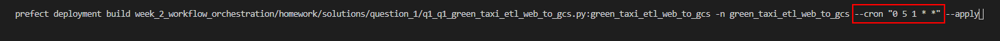

We should see this in Prefect Cloud.

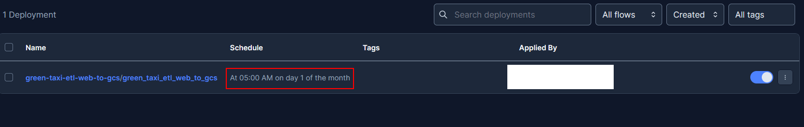


## Question 3. Loading data to BigQuery

Using `etl_gcs_to_bq.py` as a starting point, modify the script for extracting data from GCS and loading it into
BigQuery. This new script should not fill or remove rows with missing values. (The script is really just doing the E and
L parts of ETL).

The main flow should print the total number of rows processed by the script. Set the flow decorator to log the print
statement.

Parametrize the entrypoint flow to accept a list of months, a year, and a taxi color.

Make any other necessary changes to the code for it to function as required.

Create a deployment for this flow to run in a local subprocess with local flow code storage (the defaults).

Make sure you have the parquet data files for Yellow taxi data for Feb. 2019 and March 2019 loaded in GCS. Run your
deployment to append this data to your BiqQuery table. How many rows did your flow code process?

- 14,851,920
- 12,282,990
- 27,235,753
- 11,338,483

## Solution 3.

First I need to create the data in Google Cloud Storage (GCS). I’m using `parameterized_flow.py` which I adjust to read
February 2019 and March 2019 files.

**File `parameterized_flow.py`**

``` python
from pathlib import Path
import pandas as pd
from prefect import flow, task
from prefect_gcp.cloud_storage import GcsBucket
from random import randint
from prefect.tasks import task_input_hash
from datetime import timedelta


#task(retries=3, cache_key_fn=task_input_hash, cache_expiration=timedelta(days=1))
@task(retries=3)
def fetch(dataset_url: str) -> pd.DataFrame:
    """Read taxi data from web into pandas DataFrame"""
    # if randint(0, 1) > 0:
    #     raise Exception

    df = pd.read_csv(dataset_url)
    return df


@task(log_prints=True)
def clean(df: pd.DataFrame) -> pd.DataFrame:
    """Fix dtype issues"""
    df["tpep_pickup_datetime"] = pd.to_datetime(df["tpep_pickup_datetime"])
    df["tpep_dropoff_datetime"] = pd.to_datetime(df["tpep_dropoff_datetime"])
    print(df.head(2))
    print(f"columns: {df.dtypes}")
    print(f"rows: {len(df)}")
    return df


@task()
def write_local(df: pd.DataFrame, color: str, dataset_file: str) -> Path:
    """Write DataFrame out locally as parquet file"""
    path = Path(f"data/{color}/{dataset_file}.parquet")
    df.to_parquet(path, compression="gzip")
    return path


@task()
def write_gcs(path: Path) -> None:
    """Upload local parquet file to GCS"""
    gcs_block = GcsBucket.load("zoom-gcs")
    gcs_block.upload_from_path(from_path=path, to_path=path)
    return


@flow()
def etl_web_to_gcs(year: int, month: int, color: str) -> None:
    """The main ETL function"""
    dataset_file = f"{color}_tripdata_{year}-{month:02}"
    dataset_url = f"https://github.com/DataTalksClub/nyc-tlc-data/releases/download/{color}/{dataset_file}.csv.gz"

    df = fetch(dataset_url)
    df_clean = clean(df)
    path = write_local(df_clean, color, dataset_file)
    write_gcs(path)


@flow()
def etl_parent_flow(
    months: list[int] = [1, 2], year: int = 2021, color: str = "yellow"
):
    for month in months:
        etl_web_to_gcs(year, month, color)


if __name__ == "__main__":
    color = "yellow"
    months = [2, 3]
    year = 2019
    etl_parent_flow(months, year, color)
```

I run this python script `parameterized_flow.py` with these commands.

``` bash
conda activate zoom
prefect orion start
python parameterized_flow.py
```

Then I modify `etl_gcs_to_bq.py` to pull the data from GCS and load it into BigQuery without performing any data
transformation.


**File `q3_etl_gcs_to_bq.py`**

``` python
from pathlib import Path
import pandas as pd
from prefect import flow, task
from prefect_gcp.cloud_storage import GcsBucket
from prefect_gcp import GcpCredentials


@task(retries=3)
def extract_from_gcs(color: str, year: int, month: int) -> Path:
    """Download trip data from GCS"""
    gcs_path = f"data/{color}/{color}_tripdata_{year}-{month:02}.parquet"
    gcs_block = GcsBucket.load("zoom-gcs")
    gcs_block.get_directory(from_path=gcs_path, local_path=f"../data/")
    return Path(f"../data/{gcs_path}")


@task()
def write_bq(df: pd.DataFrame) -> None:
    """Write DataFrame to BiqQuery"""

    gcp_credentials_block = GcpCredentials.load("zoomcamp-gcp-creds")

    df.to_gbq(
        destination_table="trips_data_all.rides",
        project_id="wise-ally-376418",
        credentials=gcp_credentials_block.get_credentials_from_service_account(),
        chunksize=500_000,
        if_exists="append",
    )


@flow(log_prints=True)
def etl_gcs_to_bq(year: int, month: int, color: str) -> None:
    """Main ETL flow to load data into Big Query"""

    path = extract_from_gcs(color, year, month)
    df = pd.read_parquet(path)
    print(f"rows: {len(df)}")
    write_bq(df)


@flow()
def etl_parent_flow(
    months: list[int] = [2, 3], year: int = 2019, color: str = "yellow"
):
    for month in months:
        etl_gcs_to_bq(year, month, color)


if __name__ == "__main__":
    color = "yellow"
    months = [2, 3]
    year = 2019
    etl_parent_flow(months, year, color)
```

Then I create a deployment for this flow and I start the agent.

``` bash
prefect deployment build week_2_workflow_orchestration/homework/solutions/question_3/q3_etl_gcs_to_bq.py.py:etl_parent_flow -n etl_gcs_to_bq -apply
prefect agent start -q 'default'
```

We see this in the terminal window.


We see this in the Prefect Cloud.

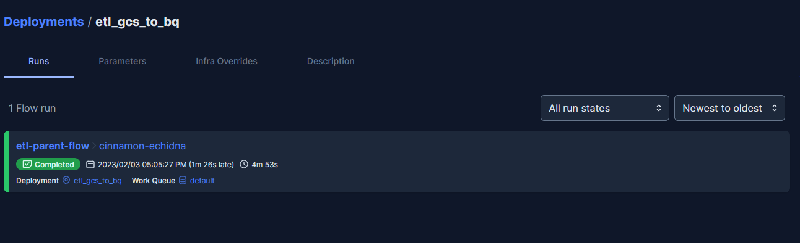

In the log of the main flow run, we can see the number of rows.

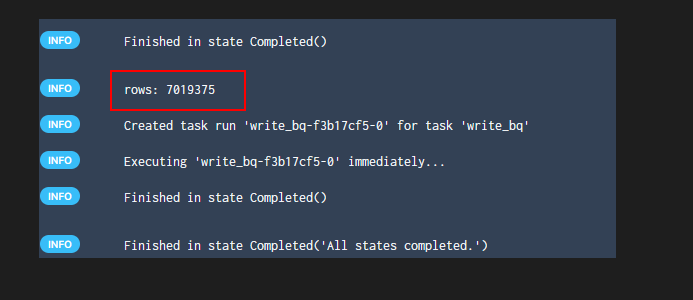

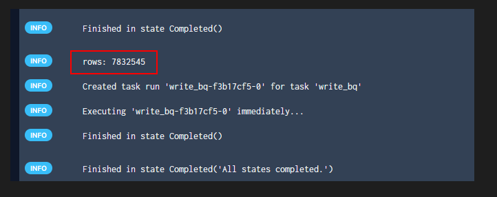

The parameters in Prefect Cloud.

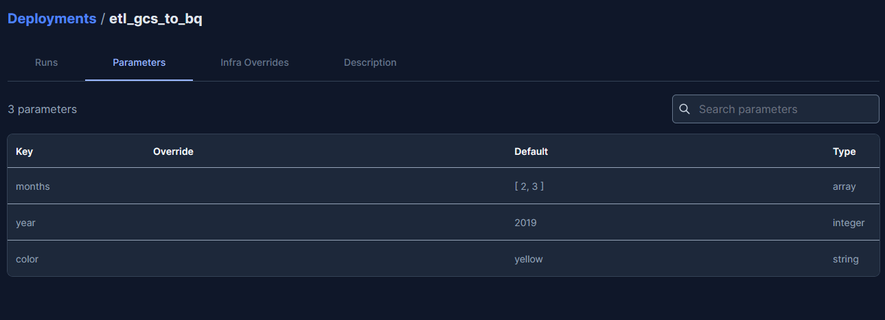

If I run a query to count the records in the BigQuery.

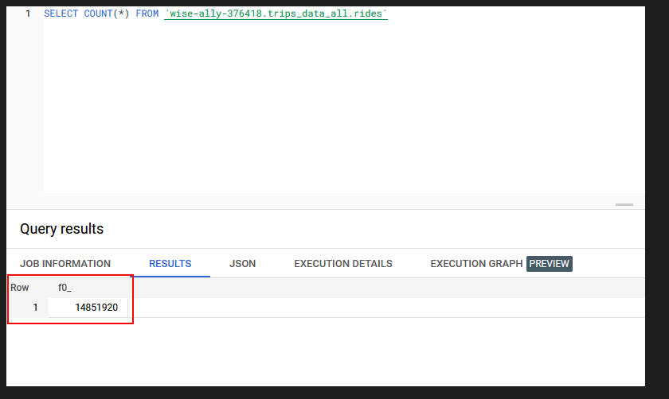

I see 7,019,375 for the February 2019 file and 7,832,545 for the March 2019 file. So that’s 14,851,920 in total.
q3_prefect_deployments_param_cloud

## Question 4. Github Storage Block

Using the `web_to_gcs` script from the videos as a guide, you want to store your flow code in a GitHub repository for
collaboration with your team. Prefect can look in the GitHub repo to find your flow code and read it. Create a GitHub
storage block from the UI or in Python code and use that in your Deployment instead of storing your flow code locally or
baking your flow code into a Docker image.

Note that you will have to push your code to GitHub, Prefect will not push it for you.

Run your deployment in a local subprocess (the default if you don’t specify an infrastructure). Use the Green taxi data
for the month of November 2020.

How many rows were processed by the script?

- 88,019
- 192,297
- 88,605
- 190,225

## Solution 4.

To answer this question, I did the following steps:

1. Modify `web_to_gcs.py` to use green taxi data for the month of November 2020.
2. Push the code to a GitHub repository.
3. Create a GitHub block (I might do this first).
4. Next, create and apply a deployment.

**Step 1**: Modify `web_to_gcs.py` to use the green taxi data for the month of November 2020.

**File `q4_etl_web_to_gcs.py`**

``` python
import os
from pathlib import Path
import pandas as pd
from prefect import flow, task
from prefect_gcp.cloud_storage import GcsBucket


@task(retries=3)
def fetch(dataset_url: str) -> pd.DataFrame:
    """Read taxi data from web into pandas DataFrame"""
    df = pd.read_csv(dataset_url)
    return df


@task(log_prints=True)
def clean(df: pd.DataFrame) -> pd.DataFrame:
    print(df.head(2))
    print(f"columns: {df.dtypes}")
    print(f"rows: {len(df)}")
    return df


@task()
def write_local(df: pd.DataFrame, color: str, dataset_file: str) -> Path:
    """Write DataFrame out locally as parquet file"""
    # Changed this to create the folder if not exists and pass if exists
    try:
        os.makedirs(f"data/{color}/", exist_ok=True)
    except FileExistsError:
        # directory already exists
        pass

    path = Path(f"data/{color}/{dataset_file}.parquet")
    # -----------------------------------------------
    df.to_parquet(path, compression="gzip")
    return path


@task()
def write_gcs(path: Path) -> None:
    """Upload local parquet file to GCS"""
    gcs_block = GcsBucket.load("zoom-gcs")
    gcs_block.upload_from_path(from_path=path, to_path=path)
    return


@flow()
def etl_web_to_gcs() -> None:
    """The main ETL function"""
    # Changed this block to use the data which is to use in homework
    color = "green"
    year = 2020
    month = 11
    # -------------------------------------------------------------
    dataset_file = f"{color}_tripdata_{year}-{month:02}"
    dataset_url = f"https://github.com/DataTalksClub/nyc-tlc-data/releases/download/{color}/{dataset_file}.csv.gz"

    df = fetch(dataset_url)
    df_clean = clean(df)
    path = write_local(df_clean, color, dataset_file)
    write_gcs(path)


if __name__ == "__main__":
    etl_web_to_gcs()
```

**Step 2**: Push the flow code to a GitHub repo.

``` bash
git add .
git commit -m "commit $(date)"
git push -u origin main
```

**Step 3**: Create a GitHub block inside Orion server.

In Orion server, I go to **Blocks** and add a **GitHub** block.

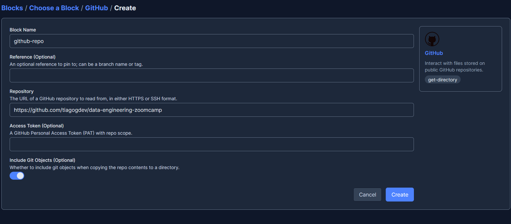


**Step 4**: Then I build and apply a deployment.

```python
from prefect.deployments import Deployment
from q4_etl_web_to_gcs import etl_web_to_gcs
from prefect.filesystems import GitHub

storage = GitHub.load("github-repo")

deployment = Deployment.build_from_flow(
    flow=etl_web_to_gcs,
    name="github-deploy",
    storage=storage,
    entrypoint="week_2_workflow_orchestration/homework/solutions/question_4/q4_etl_web_to_gcs.py:etl_web_to_gcs",
)

if __name__ == "__main__":
    deployment.apply()
```

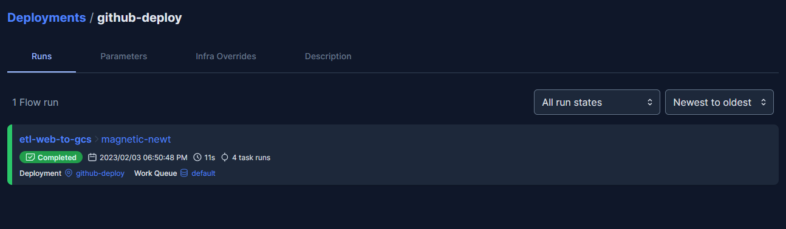

Next, I select my deployment and click on **Quick start** button.


Than answer is in the log.

**Log**

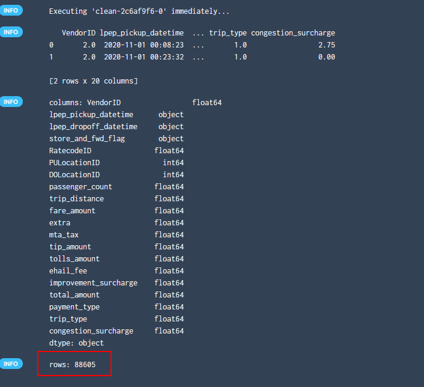


## Question 5. Email notifications

The hosted Prefect Cloud lets you avoid running your own server and has automations that allow you to get notifications
when certain events occur or don’t occur.

Create a free forever Prefect Cloud account at \[app.prefect.cloud\](<https://app.prefect.cloud/>) and connect your
workspace to it following the steps in the UI when you sign up.

Set up an Automation that will send yourself an email when a flow run succeeds. Run the deployment used in Q4 for the
Green taxi data for April 2019. Check your email to see a success notification.

How many rows were processed by the script?

- `125,268`
- `377,922`
- `728,390`
- `514,392` 

## Solution 5.

Prefect Cloud is a workflow coordination-as-a-service platform. Prefect Cloud provides all the capabilities of the
Prefect Orion Server and UI in a hosted environment, plus additional features such as automations, workspaces, and
organizations.

I created a Prefect Cloud account from there <https://www.prefect.io/pricing/> using the free **Personal** package.

I follow instruction from [Getting Started with Prefect Cloud](https://docs.prefect.io/ui/cloud-getting-started/)

Now, I start Prefect Orion on my local computer.

``` bash
conda activate zoom
prefect orion start
```

Then I modified the `q5_etl_web_to_gcs.py` script to indicate reading the April 2019 file.


**File `q5_etl_web_to_gcs.py`**


``` python
import os
from pathlib import Path
import pandas as pd
from prefect import flow, task
from prefect_gcp.cloud_storage import GcsBucket


@task(retries=3)
def fetch(dataset_url: str) -> pd.DataFrame:
    """Read taxi data from web into pandas DataFrame"""
    df = pd.read_csv(dataset_url)
    return df


@task(log_prints=True)
def clean(df: pd.DataFrame) -> pd.DataFrame:
    print(df.head(2))
    print(f"columns: {df.dtypes}")
    print(f"rows: {len(df)}")
    return df


@task()
def write_local(df: pd.DataFrame, color: str, dataset_file: str) -> Path:
    """Write DataFrame out locally as parquet file"""
    # Changed this to create the folder if not exists and pass if exists
    try:
        os.makedirs(f"data/{color}/", exist_ok=True)
    except FileExistsError:
        # directory already exists
        pass

    path = Path(f"data/{color}/{dataset_file}.parquet")
    # -----------------------------------------------
    df.to_parquet(path, compression="gzip")
    return path


@task()
def write_gcs(path: Path) -> None:
    """Upload local parquet file to GCS"""
    gcs_block = GcsBucket.load("zoom-gcs")
    gcs_block.upload_from_path(from_path=path, to_path=path)
    return


@flow()
def etl_web_to_gcs() -> None:
    """The main ETL function"""
    # Changed this block to use the data which is to use in homework
    color = "green"
    year = 2019
    month = 4
    # -------------------------------------------------------------
    dataset_file = f"{color}_tripdata_{year}-{month:02}"
    dataset_url = f"https://github.com/DataTalksClub/nyc-tlc-data/releases/download/{color}/{dataset_file}.csv.gz"

    df = fetch(dataset_url)
    df_clean = clean(df)
    path = write_local(df_clean, color, dataset_file)
    write_gcs(path)


if __name__ == "__main__":
    etl_web_to_gcs()
```

Then I run the deployment script:

``` python
from prefect.deployments import Deployment
from q5_etl_web_to_gcs import etl_web_to_gcs
from prefect.filesystems import GitHub

storage = GitHub.load("github-repo")

deployment = Deployment.build_from_flow(
    flow=etl_web_to_gcs,
    name="email-github-deploy",
    storage=storage,
    entrypoint="week_2_workflow_orchestration/homework/solutions/question_5/q5_etl_web_to_gcs.py:etl_web_to_gcs",
)

if __name__ == "__main__":
    deployment.apply()
```

Then I watch the Prefect Cloud logs where I cann see the number of rows that were processed by the script.

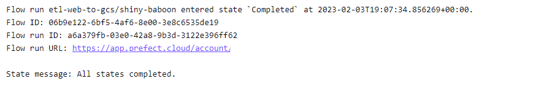

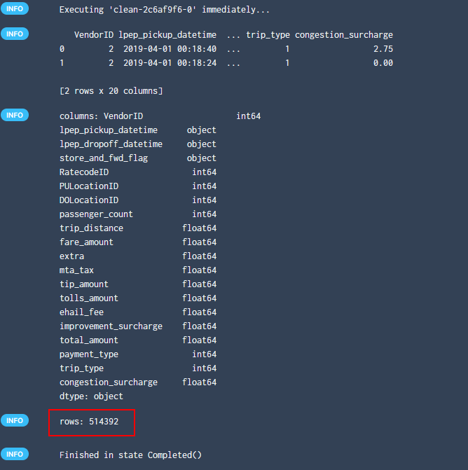


## Question 6. Secrets

Prefect Secret blocks provide secure, encrypted storage in the database and obfuscation in the UI. Create a secret block
in the UI that stores a fake 10-digit password to connect to a third-party service. Once you’ve created your block in
the UI, how many characters are shown as asterisks on the next page of the UI (\*).

- 5
- 6
- 8
- 10

## Solution to question 6

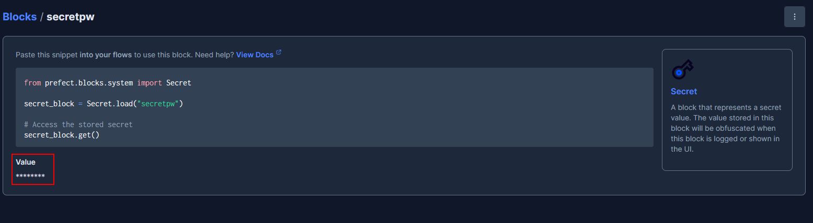
